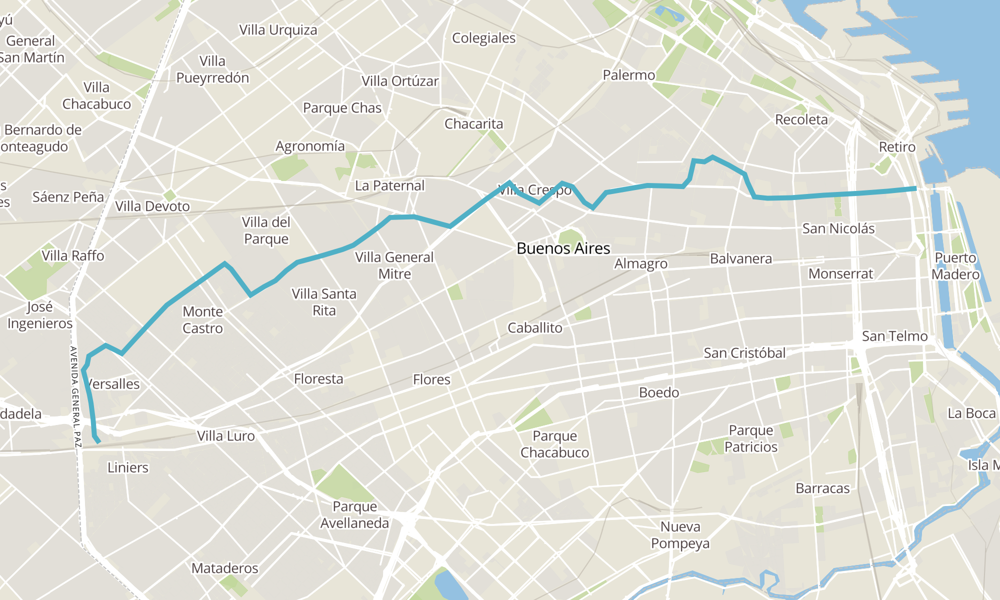
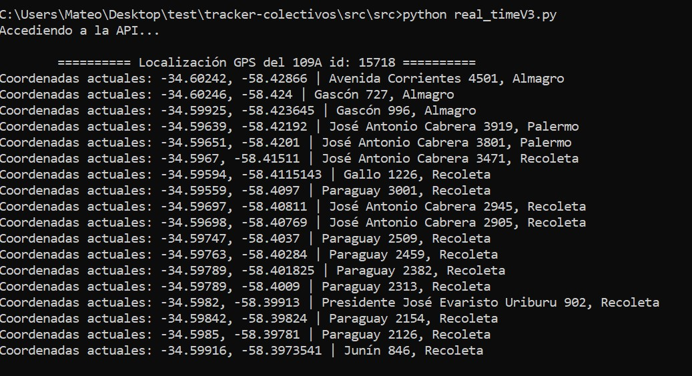
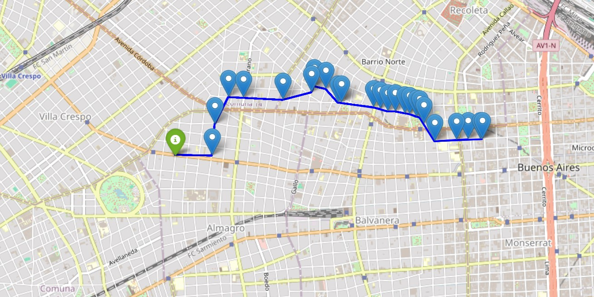

## Geolocalización de colectivos usando [BA API Transporte](https://buenosaires.gob.ar/infraestructura/movilidad/api-transporte)
Este programa usa la [API Transporte de BA](https://buenosaires.gob.ar/infraestructura/movilidad/api-transporte) para obtener en tiempo real la ubicación de un colectivo dado su código id

### Recorrido completo de la línea [109A](https://ualabee.com/index/trip/21/R00003800/77)

### Recorrido obtenido con el script:
 

### Mapa obtenido del script

Para ver el mapa interactivo en html del trayecto, descargar el archivo y abrirlo con el navegador.
[Descargar](mapa_colectivo_ejemplo.html)

## Requisitos
- Tener tu token para poder acceder a la API, [obtenelo acá](https://api-transporte.buenosaires.gob.ar).
- Conocer el id del colectivo que vas a rastrear
- Tener instaladas las siguientes bibliotecas en Python:
  - [Pandas](https://pandas.pydata.org/docs/getting_started/install.html)
  - [Folium](https://pypi.org/project/folium/)
  - [Requests](https://pypi.org/project/requests/)

### Como obtener los ID de un colectivo
Solo tenes que buscar la línea de colectivo junto con su ramal en [Transit Feeds](https://transitfeeds.com/p/colectivos-buenos-aires/1037) y copiar el id 
